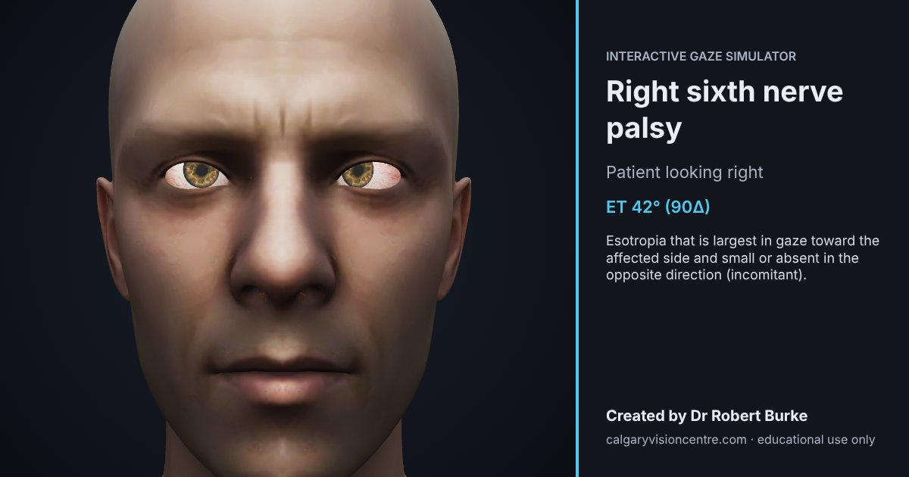

# Interactive Gaze Simulator

A free, browser-based 3D teaching model of the six extraocular muscles and cranial nerves III, IV and VI.
Move the fixation target, apply a nerve palsy or another motility disorder, and compare both eyes in the nine diagnostic positions of gaze.

Created by **Dr Robert Burke**, optometrist, Calgary Vision Centre.



## What it does

- **Thirteen cases:** normal, third, fourth and sixth nerve palsy, cavernous sinus syndrome, internuclear ophthalmoplegia, thyroid eye disease, orbital floor fracture, Brown syndrome, Duane syndrome (type I), myasthenia gravis, Miller Fisher syndrome, and skew deviation (Wallenberg). Each can be applied to the right, left or both eyes where that makes clinical sense.
- **Teaching card per case** with what to look for, clinical signs, red flags and what the model does not show.
- **Nine diagnostic positions** from a 3×3 pad or keys 1–9, laid out as the examiner sees the patient. The pointer or a finger also moves the target.
- **Manual nerve control:** cycle each CN III, IV and VI between normal, paresis and palsy.
- **Fixing eye switch** to show primary vs secondary deviation (Hering's law), a **near target** to show convergence, and a **hold-to-compare** view of a healthy patient.
- **Live readouts:** effort and force for every muscle, and the deviation in degrees and prism dioptres.
- **Motility chart → suggested diagnosis:** record the nine cardinal positions by dragging each eye in a 3×3 grid of close-up views, press Enter, and get the conditions that best reproduce the chart, with fit percentages and usual causes (`diagnose.js`). Boxes you don't touch count only weakly as normal, and common conditions get a slight head start over rare ones. Charts are shareable links too.
- **Shareable state:** the address bar always encodes the current case and gaze, e.g. `#case=cn6&side=R&gaze=4`. "Copy link" and "Save image" (a labelled 1200×630 PNG) are in the header.

## The model, honestly

This is a qualitative teaching model, not a biomechanical simulation (`engine.js`).

- Ductions are limited to physiological ranges (abduction 50°, adduction 45°, elevation 40°, depression 55°).
- **Paresis** (a weak muscle) and **restriction** (a tight muscle, as in thyroid eye disease, blowout fracture and Brown syndrome) are modelled separately, so restrictive cases limit movement away from the tight muscle instead of mimicking a palsy.
- Both eyes receive the same command, set by the **fixing eye**, so paralytic deviations are incomitant and larger when the paretic eye fixes.
- Vertical action shifts from the vertical recti in abduction to the obliques in adduction.
- **INO** and **skew deviation** act on supranuclear commands: INO spares convergence and shows abducting nystagmus; skew is comitant with full ductions.
- **Myasthenia** is fatigable: muscles weaken with sustained use and recover at rest.

Not modelled: eyelids, pupils, torsion, head tilt and saccade velocities. Displayed numbers are illustrative.

`tests/diagnose.test.mjs` charts each condition with simulated reading error and checks the matcher recovers it. `tests/engine.test.mjs` checks the clinical direction of every case in the nine positions (for example: sixth nerve esotropia is largest toward the affected side; a fourth nerve hypertropia grows down and in; thyroid eye disease gives hypotropia with limited elevation; INO converges normally at near).

## Running it locally

The page uses ES modules, so it must be served over HTTP; opening `index.html` directly from disk will not work.

```
npx serve .
# or
python3 -m http.server
```

Then open the printed address. Run the model tests with `npm test` (Node 18 or later).

## Files

| File | Purpose |
|---|---|
| `index.html` | Page, layout, styles and the reference text below the simulator |
| `main.js` | 3D scene, input, user interface, deep links and image export |
| `engine.js` | The oculomotor model (pure functions, no 3D) |
| `cases.js` | Case presets, teaching cards and usual causes |
| `diagnose.js` | Motility chart matcher: candidate conditions, scoring, plain-language findings |
| `head_eyes_v2.glb` | Head and eye model (meshopt geometry, WebP textures, 320 KB) |
| `vendor/three/` | three.js r160 and the add-ons used, served locally (MIT licence) |
| `og-image.jpg`, `favicon.svg`, `apple-touch-icon.png` | Social preview and icons |

## Deployment notes

- The canonical and social-preview URLs in `index.html` assume the page lives at `https://calgaryvisioncentre.com/gaze/`. Update the three marked lines if it lives elsewhere.
- There are no third-party requests: no CDN, web fonts, cookies or analytics.

## Browser support

Any current browser with WebGL and ES modules: Chrome or Edge 89+, Safari 16.4+, Firefox 108+.

## Licence and assets

© Dr Robert Burke. All rights reserved unless a licence file says otherwise.
The head mesh is derived from an Epic Games MetaHuman asset; its use and redistribution are governed by Epic's licence terms.
three.js is MIT licensed (`vendor/three/LICENSE`).

## Disclaimer

Educational use only. This simulator does not examine or assess anyone's eyes and is not a diagnostic tool.
